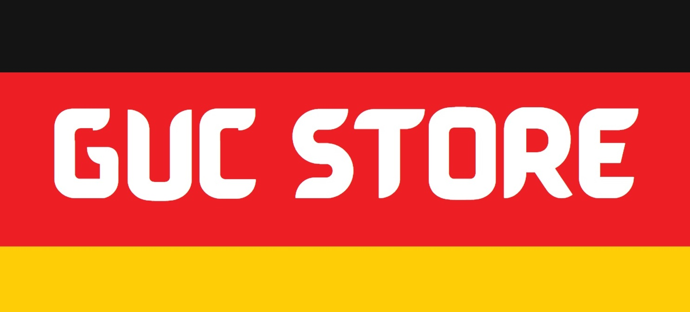

GUC STORE is an online store through which users can review products info and added to their cart in order to buy it

# Project Description :scroll:

### Course 
Introduction To Communication Networks (CSEN503)

### Overview 
The theme of the project is to build a web application that is used as a simple shopping 
website. The website allows the users to lookup products descriptions, types, manufacturers… etc.
Users are allowed to create an account, add items to their “cart” and search for products. 

### Objectives
- Gain an experience in developing a network application based on the client/server architecture.
- Learn how to build a web application that is used as a simple shopping website.
- Learn how to deal with the communication protocols to handle all website request/response.
- Learn how to host it online on a cloud platform (heroku).

Module | Depends on User Story ID | Requirement ID |          |    User Story   |             | 
-------|--------------------------|----------------|----------|-----------------|-------------|
  |    |                          |	               | **As a** |  **I want to**  | **So that**
uims| |1|Doctor|sign up|i can access the system
uims | 1 | 2 | Patient | sign in | i can use the system
uims | 5,4 | 3 | Doctor | have access to the patient health history | checks his or her disease history
uims | 16 | 4 | Doctor | upload patient case report | can be viewed anytime
ams | 16 | 5 | Doctor | upload medicine prescription | my patients can buy the prescription drugs
ams |  | 6 | Admin | upload doctor appointment schedule | patient can reserve appointments 
ams | 13 | 7 | Admin | check availability of appointment time | appointment accepted or rejected
sms | 11 | 8 | Admin | check patient feedback and comments | improve the application's environment
sms | 16 | 9 | Patient |  rate my doctor's visit | other patient could benefit from my experience 
ams | 110 | 10 | Patient | find the best doctor near my area | patient recieve great treatment
sms | 16 | 11 | Patient | add feedback | other patient could benefit from my experience 
sms |  | 12 | Patient | send message to the Pharmacy | patient can discuss medical issues 
ams | 6,72 | 13 | Patient | make an appointment  | I can see the doctor
ams | 16 | 14 | Doctor | send patient to another doctor | recieve the right treatment
uims |  | 15 | Admin | add discount | any patient come from another doctor of a different speciality take discount
ams | 23 | 16 | Doctor | examine patient | treat their illness
ams | 93 | 17 | Patient | check the best doctor for my symptoms | I don't have to ask what specialty of doctors I need to visit for my symptoms
ams |  | 19 | Patient | messages sent on the system instead of 5-minutes meetings | i can save time